<div align="center">


# 🖼️ Wallpaper Suite

**Automatic wallpaper & lock-screen image rotation for every Linux desktop.**

Fresh, high-quality images from 5 different APIs — applied to your desktop, lock screen
and boot login page. On schedule. Forever. Zero maintenance.

[](https://github.com/hawkcode247/Wallpaper-Updater/blob/main/LICENSE)
[](https://www.gnu.org/software/bash/)
[](https://github.com/hawkcode247/Wallpaper-Updater/releases/latest)
[-orange?logo=linux)](#compatibility)
[](https://github.com/hawkcode247/Wallpaper-Updater/blob/main/CONTRIBUTING.md)

[Install](#installation) · [Features](#features) · [Compatibility](#compatibility) ·
[Debugging](#debugging) · [Uninstall](#uninstall) · [Donate](#donate)

<br/>

<a href="https://github.com/hawkcode247/Wallpaper-Updater/releases/latest/download/WallpaperSuite-x86_64.AppImage">

</a>
&nbsp;
<a href="https://github.com/hawkcode247/Wallpaper-Updater/releases">

</a>

<br/><br/>

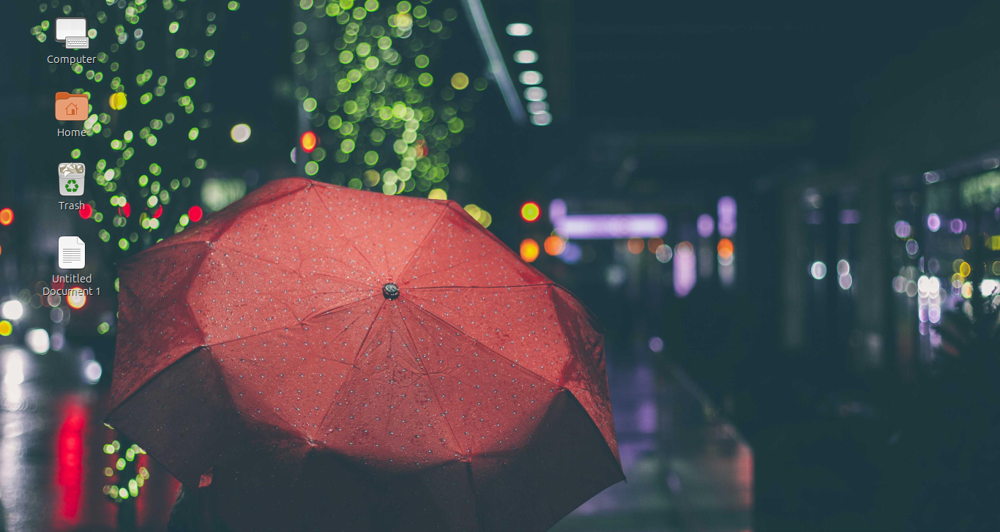

</div>

---

<a id="features"></a>
## ✨ Features

| | |
|---|---|
| 🎲 **5 free image sources** | Windows Spotlight · Bing Daily · NASA APOD · Wallhaven · Lorem Picsum — random pick each run, automatic fallback when one fails |
| 🖥️ **Screen-size aware** | Detects your display (xrandr / wlr-randr / hyprctl / DRM) and rejects images smaller than it |
| 🚫 **Never repeats** | URL + SHA-256 history — you won't see the same image twice |
| 🔒 **Lock screen + login page** | One constant image path; GDM theme patch, LightDM (gtk/slick), SDDM, LXDM, AccountsService |
| 🔔 **Smart notifications** | Compact popup with a **[View]** button linking to the image's source page |
| 💾 **Storage cap** | 500 MB / 1 GB / custom archive — oldest images pruned automatically |
| ⏰ **Set & forget** | systemd user timers: wallpaper every 2.5 h, lock screen every 4 h, catch-up after suspend |
| 🧰 **Self-healing** | Fixes its own permissions, auto-installs missing dependencies (with consent), single-instance lock, crash-proof on unknown DEs |

## 🖥️ UI Tour

> Real screenshots — Wallpaper Suite running on Linux Mint (zenity dialogs, GTK theme).

<div align="center">

### 🏠 The Main Menu
*One dialog drives everything — status-aware, the most likely action is pre-selected.*

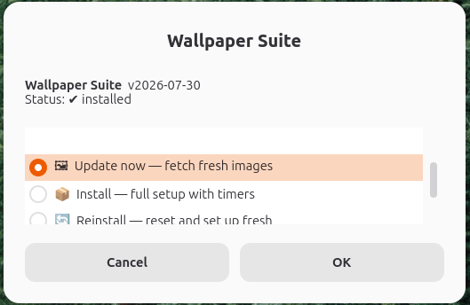

---

### 📦 Install — a guided 4-step journey

| Step 1 — Keep old wallpapers? | Step 2 — Pick a storage cap |
|:---:|:---:|
| 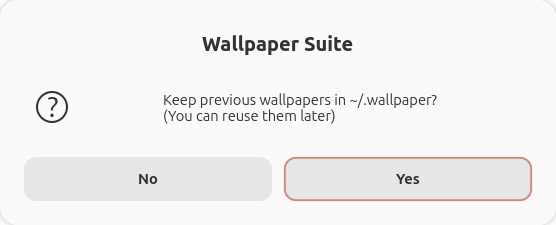 | 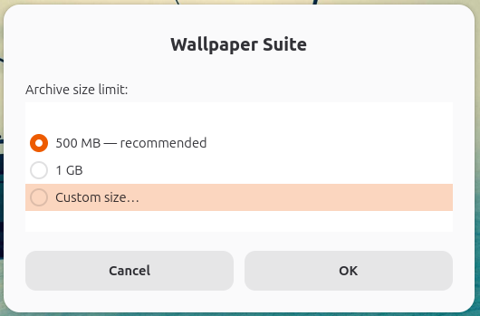 |
| *Archive previous wallpapers for reuse* | *500 MB · 1 GB · or your own* |

| Step 3 — Custom size (optional) | Step 4 — One-time password notice |
|:---:|:---:|
| 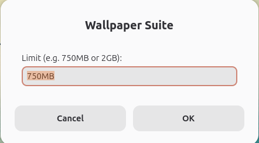 | 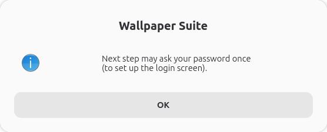 |
| *Accepts `750MB`, `2GB`, …* | *sudo asked exactly once — never again* |

### ✅ Install finished
*Everything confirmed at a glance — wallpaper, lock screen, timers — plus the log path.*

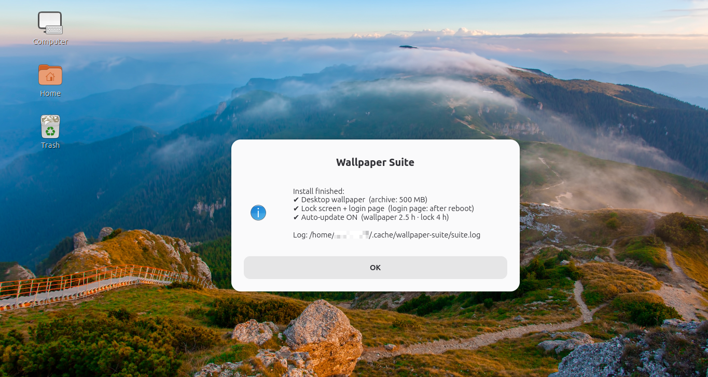

---

### 🖼 The Result
*A fresh wallpaper is already on the desktop the moment setup ends.*


### ⚡ Update now
*Pick "Update now" anytime — two progress bars later:*

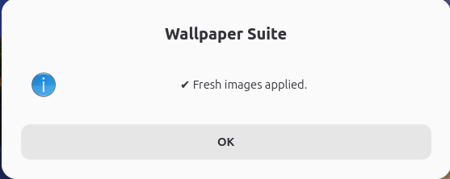

---

### 🗑 Uninstall — clean exit, no leftovers

| Confirm | Keep or delete scripts | Done |
|:---:|:---:|:---:|
| 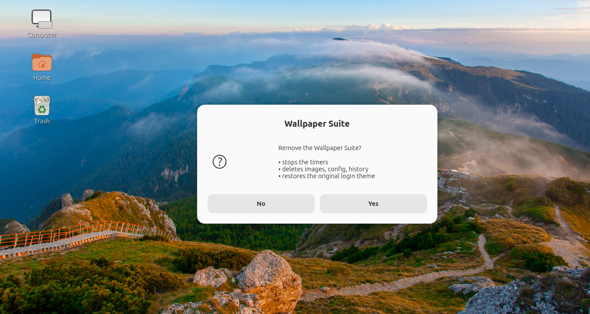 | 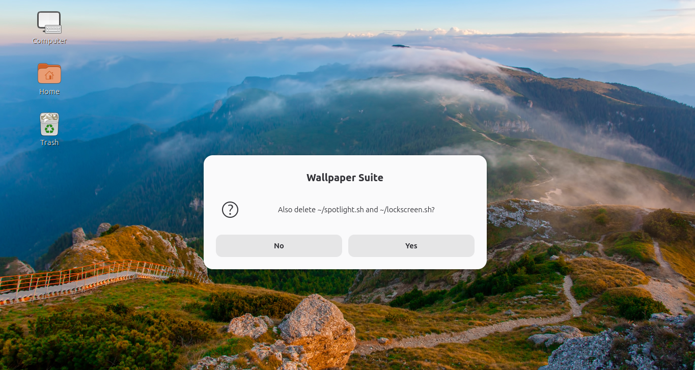 | 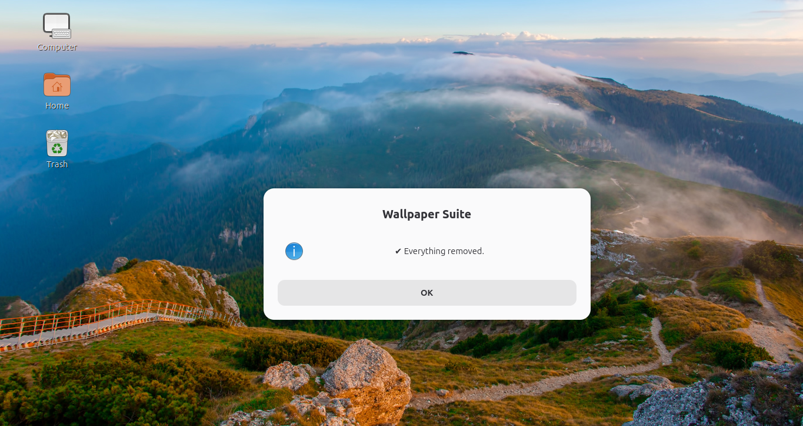 |
| *Shows exactly what is removed* | *Your choice* | *Login theme restored too* |

</div>

## 📸 How it works

```
┌─────────────┐          ┌───────────────┐          ┌─────────────────────────┐
│  5 free     │  random  │  download     │ validate │  desktop wallpaper      │
│  image APIs │─────────▶│  + dedup      │─────────▶│  lock screen            │
│  + fallback │          │  (≥ screen)   │          │  login page (GDM, …)    │
└─────────────┘          └───────────────┘          └─────────────────────────┘
       ▲                                                         │
       └───────────────── systemd timers (2.5h / 4h) ────────────┘
```

<a id="installation"></a>
## 🚀 Installation

### Quick start (copy / paste)

Download the AppImage (x86_64) and run it (recommended):

```bash
# with wget
wget -O WallpaperSuite-x86_64.AppImage \
  https://github.com/hawkcode247/Wallpaper-Updater/releases/latest/download/WallpaperSuite-x86_64.AppImage

# or with curl
curl -L -o WallpaperSuite-x86_64.AppImage \
  https://github.com/hawkcode247/Wallpaper-Updater/releases/latest/download/WallpaperSuite-x86_64.AppImage

chmod +x WallpaperSuite-x86_64.AppImage
./WallpaperSuite-x86_64.AppImage
```

Choose "📦 Install" in the menu and follow the guided setup.

> Tip: Run the AppImage as your normal user (never sudo). The installer will ask for your
> password only once if it needs it for the login-screen setup.

### Option 1 — AppImage (portable)

Download **`WallpaperSuite-x86_64.AppImage`** from the Releases page, then:

```bash
chmod +x WallpaperSuite-x86_64.AppImage
./WallpaperSuite-x86_64.AppImage        # or just double-click it
```

Choose **📦 Install** in the menu. Done.

> Note: If your browser/download manager renamed the file, rename it back to the exact
> filename above.

### Option 2 — All-in-one script

```bash
bash wallpaper-suite.sh                 # GUI menu: Install / Reinstall / Uninstall / Update now
```

### Option 3 — Individual components

```bash
bash spotlight.sh          # desktop wallpaper only (setup wizard on first run)
bash lockscreen.sh next    # lock screen + login page only
# timers: use `wallpaper-suite.sh install` — units are embedded in it
```

### Enable timers manually (systemd user)

If you prefer to enable the timers yourself (or your system did not automatically), run:

```bash
# reload user systemd units (after install)
systemctl --user daemon-reload

# enable and start the timers
systemctl --user enable --now spotlight.timer
systemctl --user enable --now lockscreen.timer

# check status
systemctl --user status spotlight.timer lockscreen.timer
```

If you don't use systemd user sessions, the installer prints a cron fallback line you
can add to your crontab.

> **First run notes**
> - Run as your **normal user** — *never* `sudo`. The installer asks for your password
>   exactly once (login-screen setup); automatic runs never need it again.
> - The **login page** image becomes visible after your next reboot.
> - Fresh downloads have no execute bit — that's why the first run is `bash <file>`;
>   the script offers to `chmod +x` itself so `./` works afterwards.

### What gets installed where

| Item | Path |
|---|---|
| Scripts | `~/spotlight.sh`, `~/lockscreen.sh` |
| Config | `~/.config/wallpaper/config` |
| Wallpapers + archive | `~/.local/share/backgrounds/`, `~/.wallpaper/` |
| Lock/login image (constant path) | `/usr/share/backgrounds/lockscreen.jpg` |
| systemd user units | `~/.config/systemd/user/{spotlight,lockscreen}.{service,timer}` |
| Logs | `~/.local/share/spotlight/wallpaper.log`, `~/.cache/wallpaper-suite/suite.log` |

## 🔄 Reinstall

Resets config, history and logs, then runs a fresh setup (asks separately whether
to keep your downloaded images):

```bash
./WallpaperSuite-x86_64.AppImage reinstall     # AppImage — or menu → 🔄 Reinstall
bash wallpaper-suite.sh reinstall              # all-in-one script
bash spotlight.sh reinstall                    # component-level (wallpaper only)
```

<a id="uninstall"></a>
## 🗑 Uninstall

One command removes **everything** — timers, units, config, history, downloaded
images — and **restores the original login theme** (GDM gresource backup):

```bash
./WallpaperSuite-x86_64.AppImage uninstall     # AppImage — or menu → 🗑 Uninstall
bash wallpaper-suite.sh uninstall              # all-in-one script
```

You'll be asked whether to also delete the two scripts themselves.

## 📦 Dependencies

The suite checks **only what your system actually needs** and offers to install it
(apt · dnf · yum · pacman · zypper · apk · xbps · emerge):

| Dependency | Needed for | Required? |
|---|---|---|
| `bash` ≥ 4, `jq` | core / JSON parsing | ✔ required |
| `wget` **or** `curl` | downloads (either one) | ✔ required |
| `gsettings`, `kwriteconfig5/6`, `xfconf-query`, … | applying the wallpaper | ships with your DE |
| `xrandr` / `wlr-randr` | screen-size detection | optional (session-specific) |
| `identify` (ImageMagick) / `file` | resolution validation | optional |
| `glib-compile-resources`, `gresource` | GDM login-page patch | optional (GDM systems only) |
| `zenity` / `kdialog` / `yad` | GUI dialogs | optional (terminal fallback) |
| `systemd` (user session) | timers | optional (cron line printed otherwise) |

<a id="debugging"></a>
## 🐞 Debugging

```bash
bash wallpaper-suite.sh --debug                    # live trace of every step
cat ~/.cache/wallpaper-suite/suite.log             # persistent suite log (incl. failing line + command)
cat ~/.local/share/spotlight/wallpaper.log         # per-run wallpaper log (cleared on success)
systemctl --user list-timers                       # are the timers scheduled?
journalctl --user -u spotlight.service -n 20       # what did the last timer run do?
bash spotlight.sh --source bing --no-fallback      # test one source, raw errors
```

Common issues:

| Symptom | Cause → Fix |
|---|---|
| `Permission denied` on `./script.sh` | fresh download has no exec bit → run `bash script.sh` once (it fixes itself) |
| Wallpaper doesn't change | ran with `sudo` → run as your user (the script now auto-drops back) |
| Login page unchanged | GDM shows it after **reboot**; check `sudo systemctl restart gdm3` |
| Notification without buttons | your daemon lacks the `actions` capability → plain credit line is shown |
| `OVER_RATE_LIMIT` from NASA | shared `DEMO_KEY` exhausted → get a free key: `NASA_API_KEY=xxx` |

<a id="compatibility"></a>
## 🧩 Compatibility

**Desktops:** GNOME · KDE Plasma · XFCE · Cinnamon · MATE · LXQt/LXDE · Budgie ·
Deepin · Pantheon · Sway · Hyprland · i3/openbox (via feh/nitrogen/xwallpaper/swww/swaybg)
**Greeters:** GDM (incl. Ubuntu Yaru) · LightDM gtk/slick · SDDM · LXDM
**Sessions:** X11 & Wayland · **Init:** systemd timers (or cron fallback)

## 🛠 Building from source

`wallpaper-suite.sh` ships with both scripts and the systemd units embedded —
it **is** the source and the build. Edit `spotlight.sh` / `lockscreen.sh` and
re-embed them (base64) into the suite if you fork the project.

<a id="donate"></a>
## ❤️ Support the project
<details>
<summary><b>&nbsp;🌍 Tap here for your support sir!</b></summary>
<br/>
<div align="center">
<table><tr>
<td align="center" width="50%"></td>
<td align="center" width="50%"></td>
</tr></table>

> 🌳 *Like planting a tree — small acts grow into something that shelters everyone.*
</div>
</details>

If Wallpaper Suite saves you time, consider supporting development:

[](https://github.com/sponsors/hawkcode247)

⭐ **Starring the repo** helps others find it — and costs nothing!

## 🙏 Credits

- **Image sources:** [Windows Spotlight](https://www.microsoft.com) (Microsoft),
  [Bing Image of the Day](https://www.bing.com) (Microsoft),
  [NASA APOD](https://apod.nasa.gov), [Wallhaven](https://wallhaven.cc),
  [Lorem Picsum](https://picsum.photos) / [Unsplash](https://unsplash.com) photographers
- **Tools:** [appimagetool](https://github.com/AppImage/appimagetool), zenity, jq
- All wallpaper copyrights belong to their respective owners; the **[View]**
  notification button always links to the original source for attribution.

## 📄 License & Disclaimer

[MIT](https://github.com/hawkcode247/Wallpaper-Updater/blob/main/LICENSE) — do whatever you want, no warranty.
**Please read the [DISCLAIMER](https://github.com/hawkcode247/Wallpaper-Updater/blob/main/DISCLAIMER.md)** — liability, bug reporting,
and how to get authorized as a collaborator.
